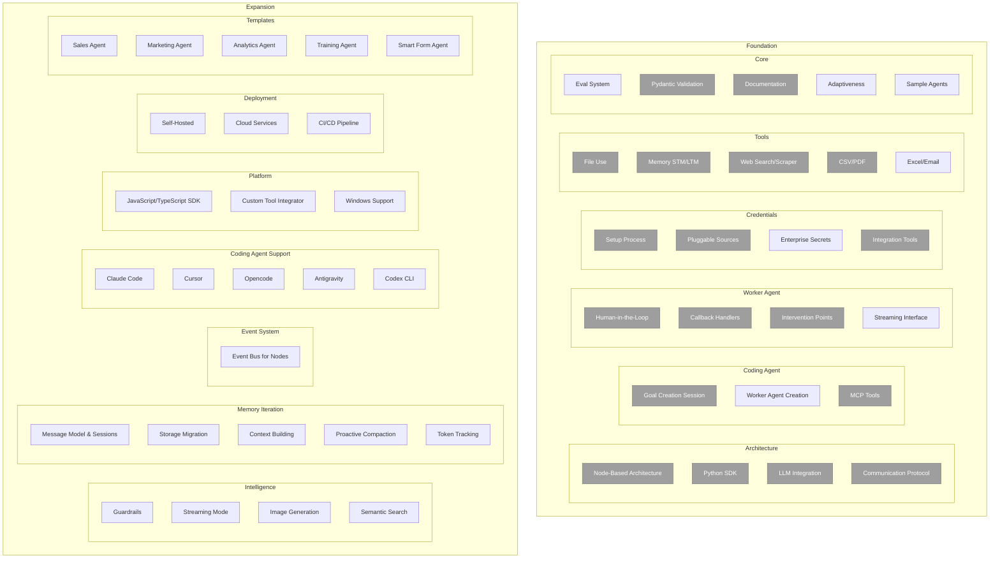

# Product Roadmap

Aden Agent Framework aims to help developers build outcome oriented, self-adaptive agents. Please find our roadmap here

---

## Phase 1: Foundation

### Backbone Architecture
- [ ] **Node-Based Architecture (Agent as a node)**
    - [x] Object schema definition
    - [x] Node wrapper SDK
    - [x] Shared memory access
    - [ ] Default monitoring hooks
    - [x] Tool access layer
    - [x] LLM integration layer (Natively supports all mainstream LLMs through LiteLLM)
        - [x] Anthropic
        - [x] OpenAI
        - [x] Google
- [x] **Communication protocol between nodes**
- [x] **[Coding Agent] Goal Creation Session** (separate from coding session)
    - [x] Instruction back and forth
    - [x] Goal Object schema definition
    - [x] Being able to generate the test cases
    - [x] Test case validation for worker agent (Outcome driven)
- [ ] **[Coding Agent] Worker Agent Creation**
    - [x] Coding Agent tools
    - [ ] Use Template Agent as a start
    - [x] Use our MCP tools
- [ ] **[Worker Agent] Human-in-the-Loop**
    - [x] Worker Agents request with questions and options
    - [x] Callback Handler System to receive events throughout execution
    - [x] Tool-Based Intervention Points (tool to pause execution and request human input)
    - [x] Multiple entrypoint for different event source (e.g. Human input, webhook)
    - [ ] Streaming Interface for Real-time Monitoring
    - [x] Request State Management

### Credential Management
- [x] **Credentials Setup Process**
    - [x] Install Credential MCP
- [x] **Pluggable Credential Sources**
    - [x] **Abstraction & Local Sources**
        - [x] Introduce `CredentialSource` base class
        - [x] Refactor existing logic into `EnvVarSource`
        - [x] Implementation of Source Priority Chain mechanism
        - [ ] Foundation unit tests
    - [ ] **Enterprise Secret Managers**
        - [x] `VaultSource` (HashiCorp Vault)
        - [ ] `AWSSecretsSource` (AWS Secrets Manager)
        - [ ] `AzureKeyVaultSource` (Azure Key Vault)
        - [ ] Management of optional provider dependencies
    - [ ] **Advanced Features**
        - [x] Credential expiration and auto-refresh
        - [ ] Audit logging for compliance/tracking
        - [ ] Per-environment configuration support
    - [ ] **Documentation & DX**
        - [ ] Comprehensive source documentation
        - [ ] Example configurations for all providers
    - [x] **Integration as tools coverage**
        - [x] Gsuite Tools
        - [x] Social Media
            - [ ] Twitter(X)
            - [x] Github
            - [ ] Instagram
        - [ ] SAAS
            - [x] Hubspot
            - [x] Slack
            - [ ] Teams
            - [ ] Zoom
            - [ ] Stripe
            - [ ] Salesforce

> [!IMPORTANT]
> **Community Contribution Wanted**: We appreciate help from the community to expand the "Integration as tools" capability. Leave an issue of the integration you want to support via Hive!

### Essential Tools
- [x] **File Use Tool Kit**
- [X] **Memory Tools**
    - [x] STM Layer Tool (state-based short-term memory)
    - [x] LTM Layer Tool (RLM - long-term memory)
- [ ] **Infrastructure Tools**
    - [x] Runtime Log Tool (logs for coding agent)
    - [x] Web Search
    - [x] Web Scraper
    - [x] CSV tools
    - [x] PDF tools
    - [x] Excel tools
    - [ ] Email Tools
    - [ ] Recipe for "Add your own tools"

### Memory & File System
- [x] DB for long-term persistent memory (Filesystem as durable scratchpad pattern)
- [x] Session Local memory isolation

### Eval System (Basic)
- [x] Test Driven - Run test case for all agent iteration
- [ ] Failure recording mechanism
- [ ] SDK for defining failure conditions
- [ ] Basic observability hooks
- [ ] User-driven log analysis (OSS approach)

### Data Validation
- [x] Natively Support data validation of LLMs output with Pydantic

### Developer Experience
- [ ] **MVP Features**
    - [ ] Debugging mode
    - [ ] CLI tools for memory management
    - [ ] CLI tools for credential management
- [ ] **MVP Resources & Documentation**
    - [x] Quick start guide
    - [x] Goal creation guide
    - [x] Agent creation guide
    - [x] GitHub Page setup
    - [x] README with examples
    - [x] Contributing guidelines
    - [ ] Introduction Video

### Adaptiveness
- [ ] Runtime data feedback loop
- [ ] Instant Developer Feedback for improvement

### Sample Agents
- [ ] Knowledge Agent
- [ ] Blog Writer Agent
- [ ] SDR Agent

---

## Phase 2: Expansion

### Basic Guardrails
- [ ] Support Basic Monitoring from Agent node SDK
- [ ] SDK guardrail implementation (in node)
- [ ] Guardrail type support (Determined Condition as Guardrails)

### Agent Capability
- [ ] Streaming mode support
- [ ] Image Generation support
- [ ] Take end user input Image and flatfile understand capability

### Event-loop For Nodes (Opencode-style)
- [ ] **Event bus**

### Memory System Iteration
- [ ] **Message Model & Session Management**
    - [ ] Introduce `Message` class with structured content types
    - [ ] Implement `Session` classes for conversation state
- [ ] **Storage Migration**
    - [ ] Implement granular per-message file persistence (`/message/[agentID]/...`)
    - [ ] Migrate from monolithic run storage
- [ ] **Context Building & Conversation Loop**
    - [ ] Implement `Message.stream(sessionID)`
    - [ ] Update `LLMNode.execute()` for full context building
    - [ ] Implement `Message.toModelMessages()` conversion
- [ ] **Proactive Compaction**
    - [ ] Implement proactive overflow detection
    - [ ] Develop backward-scanning pruning strategy (e.g., clearing old tool outputs)
- [ ] **Enhanced Token Tracking**
    - [ ] Extend `LLMResponse` to track reasoning and cache tokens
    - [ ] Integrate granular token metrics into compaction logic

### Coding Agent Support
- [ ] Claude Code
- [ ] Cursor
- [ ] Opencode
- [ ] Antigravity
- [ ] Codex CLI (in progress)

### File System Enhancement
- [ ] Semantic Search integration
- [ ] Interactive File System in product (frontend integration)

### More Worker Tools
- [ ] Custom Tool Integrator
- [ ] Integration as a tool (Credential Store & Support)
- [ ] **Core Agent Tools**
    - [ ] Node Discovery Tool (find other agents in the graph)
    - [ ] HITL Tool (pause execution for human approval)
    - [ ] Wake-up Tool (resume agent tasks)

### Deployment (Self-Hosted)
- [ ] Workder agent docker container standardization
- [ ] Headless backend execution
- [ ] Exposed API for frontend attachment
- [ ] Local monitoring & observability
- [ ] Basic lifecycle APIs (Start, Stop, Pause, Resume)

### Deployment (Cloud)
- [ ] Cloud Service Options
- [ ] Support deployment to 3rd-party platforms
- [ ] Self-deploy + orchestrator connection
- [ ] **CI/CD Pipeline**
    - [ ] Automated test execution
    - [ ] Agent version control
    - [ ] All tests must pass for deployment

### Developer Experience Enhancement
- [ ] Tool usage documentation
- [ ] Discord Support Channel

### More Agent Templates
- [ ] GTM Sales Agent (workflow)
- [ ] GTM Marketing Agent (workflow)
- [ ] Analytics Agent
- [ ] Training Agent
- [ ] Smart Entry / Form Agent (self-evolution emphasis)

### Cross-Platform
- [ ] JavaScript / TypeScript Version SDK
- [ ] Better windows support
